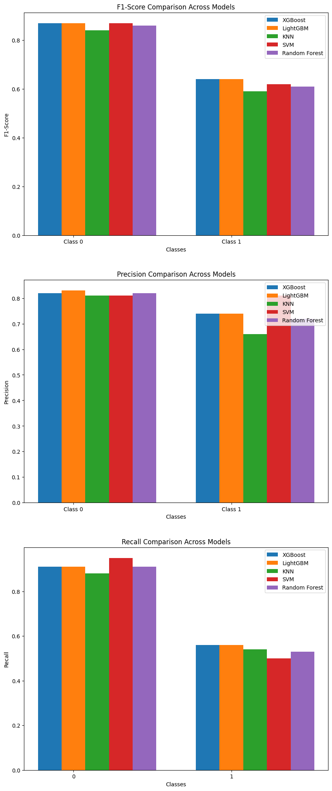

# Comparison of methods for toxicity prediction from SMILEs

Authors:
- Adam Mytnik
- Igor Urbanik
- Jakub Pryc
- Krzysztof Pęczek
- Szymon Rusiecki
- Wojciech Barczyński

# Problem description

The task of toxicity prediction involves determining the potential toxic effects of chemical compounds based on their molecular structure. This is a critical problem in fields such as drug discovery, environmental science, and chemical safety. In this project, we explore various computational methods to predict toxicity directly from SMILES (Simplified Molecular Input Line Entry System) representations of molecules. We aim to identify approaches that achieve the best results on tested datasets by comparing traditional baselines with advanced Graph Machine Learning models.

# Baseline - classical algorithms

In our baseline approach, we extract molecular fingerprints from SMILES representations using the `scikit-fingerprints` library. These fingerprints serve as feature vectors that capture the structural properties of the molecules. We then treat the toxicity prediction task as a classical classification problem, applying traditional machine learning algorithms, such as Gradient Boosting (LightGBM and XGBoost), kNN and SVM, to predict toxicity labels based on these features.

Code for the testing of all baseline algorithms can be found in `baseline.ipynb` notebook.

## Baseline results summary

The baseline methods demonstrated varying levels of performance in toxicity prediction:

- **KNN** achieved an overall accuracy of 78%, with a higher recall for non-toxic compounds (class 0) but struggled with toxic compounds (class 1).
- **XGBoost** performed slightly better, achieving an accuracy of 80%, with improved precision and recall for both classes compared to KNN.
- **LightGBM** delivered the best results among the baseline methods, with an accuracy of 81% and slightly better performance across precision, recall, and f1-score.

These results highlight the potential of classical machine learning algorithms for toxicity prediction, while also indicating room for improvement, particularly in identifying toxic compounds.

# Graph ML models

TODO
