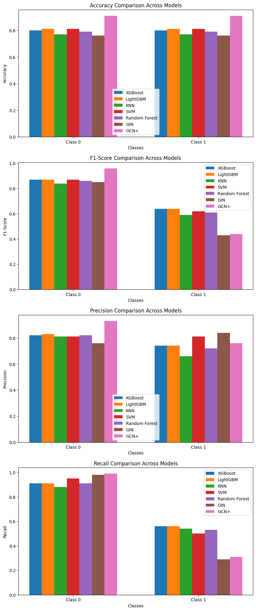

# Comparison of methods for toxicity prediction from SMILEs

Authors:
- Adam Mytnik
- Igor Urbanik
- Jakub Pryc
- Krzysztof Pęczek
- Szymon Rusiecki
- Wojciech Barczyński

# Problem description

The task of toxicity prediction involves determining the potential toxic effects of chemical compounds based on their molecular structure. This is a critical problem in fields such as drug discovery, environmental science, and chemical safety. In this project, we explore various computational methods to predict toxicity directly from SMILES (Simplified Molecular Input Line Entry System) representations of molecules. We aim to identify approaches that achieve the best results on tested datasets by comparing traditional baselines with advanced Graph Machine Learning models.

# Dataset selection

In this project, we primarily evaluate our models on the `peptides_func` dataset. While the `tox_21` dataset was initially considered, it proved to be significantly more challenging due to its complexity and class imbalance. The `peptides_func` dataset offers a more manageable starting point, allowing us to effectively compare the performance of different methods and gain meaningful insights into their strengths and weaknesses.

# Baseline - classical algorithms

In our baseline approach, we extract molecular fingerprints from SMILES representations using the `scikit-fingerprints` library. These fingerprints serve as feature vectors that capture the structural properties of the molecules. We then treat the toxicity prediction task as a classical classification problem, applying traditional machine learning algorithms, such as Gradient Boosting (LightGBM and XGBoost), kNN and SVM, to predict toxicity labels based on these features.

Code for the testing of all baseline algorithms can be found in the `baseline.ipynb` notebook.

## Baseline results summary
The baseline methods demonstrated varying levels of performance in toxicity prediction on the `peptides_func` dataset:

- **KNN** achieved an overall accuracy of 77%, with a higher recall for non-toxic compounds (class 0) but struggled with toxic compounds (class 1).
- **XGBoost** performed slightly better, achieving an accuracy of 80%, with improved precision and recall for both classes compared to KNN.
- **LightGBM** achieved an overall accuracy of 81% and slightly better performance across precision, recall, and f1-score.
- **SVM** achieved an overall accuracy of 81%. It demonstrated high precision (81%) and recall (95%) for non-toxic compounds (class 0), but its performance for toxic compounds (class 1) was less effective, with a recall of 50% and an f1-score of 62%.
- **Random Forest** achieved an overall accuracy of 79%. It demonstrated high precision (82%) and recall (91%) for non-toxic compounds (class 0), but its performance for toxic compounds (class 1) was less effective, with a recall of 53% and an f1-score of 61%.

These results highlight the potential of classical machine learning algorithms for toxicity prediction, while also indicating room for improvement, particularly in identifying toxic compounds.


# Graph ML models

## GIN

The Graph Isomorphism Network (GIN) is a simple yet powerful graph neural network designed to capture graph structure effectively. It is based on the Weisfeiler-Lehman graph isomorphism test.

The Graph Isomorphism Network (GIN) model achieved the following results on the `peptides_func` dataset:

- **Class 0 (Non-toxic)**: Precision 0.76, Recall 0.98, F1-score 0.85 (2153 samples)
- **Class 1 (Toxic)**: Precision 0.84, Recall 0.29, F1-score 0.43 (954 samples)
- **Overall**: Accuracy 76%, Macro F1-score 0.64, Weighted F1-score 0.72

GIN excels in identifying non-toxic compounds but struggles with toxic ones, achieving only 29% recall for class 1. This highlights the need for better handling of class imbalance.

The code for GIN can be found in the  `gin.ipynb` notebook.

## GCN+

The GCN+ model based on a [2025 ICML paper](https://arxiv.org/pdf/2502.09263) attempts to prove that complicated Graph Transformer Networks are overly complicated for many tasks. Simple GCN networks with additional functionalities can match and on many occasions outperform more complicated models. GCN+ uses these techniques to achieve this performance:
 - Edge Feature Integration - Augments the message-passing algorithm with edge features
 - Normalization - Applies the GraphNorm algorithm from [this paper](https://arxiv.org/pdf/2009.03294) to improve generalization
 - Dropout - GCN+ introduces dropout both in the message-passing algorithm and the MLP head
 - Residual Connections - Adds residual connections to fight with vanishing gradients
 - Positional Encoding - Encodes structural roles into node features

The GCN+ model has the following performance on the `peptides_func` dataset:
 - **Class 0 (Non-toxic)**: Precision 0.93, Recall 0.99, F1-score 0.96 (2153 samples)
 - **Class 1 (Toxic)**: Precision 0.76, Recall 0.31, F1-score 0.44 (954 samples)
 - **Overall**: Accuracy 91%, Macro F1-score 0.70, Weighted F1-score 0.88

GCN+ shows strong performance on the dominant non-toxic class, but, like GIN, continues to struggle with detecting toxic peptides with class 1 recall remaining low at 31%. Despite additional techniques, the class imbalance is a serious issue. One advantage of the GCN+ approach is its inference and training speed. 

The code for GCN+ is the same as the authors used and can be found in the authors' repo: https://github.com/LUOyk1999/GNNPlus

## GRIT

The Graph Inductive bias Transformer (GRIT) model achieved the following results on the `peptides_func` dataset:

- **Accuracy**: 91.0%
- **Average Precision**: 0.59
- **Area under curve**: 0.88

Overall accuracy is relatively high at 91.0%. The AUC score of 0.88 shows good class separability, although the average precision of 0.59 suggests there is room for improvement in how it ranks relevant instances.



The code for GRIT is the same as the authors used and can be found in the authors' repo: https://github.com/liamma/grit

# Obstacles in reproducing results

## Issues with Top Leaderboard Results

During our exploration, we attempted to replicate some of the top-performing methods for toxicity prediction listed on "Papers with Code". Unfortunately, several of these methods presented significant challenges:

- **Unreplicable Results**: Some methods lacked sufficient implementation details or had discrepancies between the reported results and the available code, making it impossible to reproduce their performance.
- **Code Failures**: In certain cases, the provided codebases were incomplete, outdated, or incompatible with current software dependencies, leading to runtime errors or failures during execution.

These issues highlight the importance of reproducibility and transparency in machine learning research, as they directly impact the ability to validate and build upon existing work.

## Neural Walker
We were unable to reproduce the authors' results. In [Neural Walker](https://github.com/BorgwardtLab/NeuralWalker) repository authors claim that installation is pretty straightforward. The whole setup process should use three commands:
```
micromamba env create -f environment.yaml 
micromamba activate neuralwalker
pip install -e .
```
where we could choose between `micromamba` and `miniconda`. In the first attempt, we used `miniconda`, unfortunately, it failed during CUDA dependencies initialization. The second attempt was with `micromamba` but the outcome was same as before. The authors proposed two config files: `enviroment.yaml` and `enviroment_latest.yaml`. Those files differ in that `enviroment_latest.yaml` doesn't work at all and `enviroment.yaml` fails during CUDA initialization. 

## GRED
We were unable to reproduce the authors' results as a version of dependencies provided by them were incompatible with each other, and even after long trials to resolve these conflicts, the peptides preprocessing step provided by the authors required computational resources, specifically RAM memory, beyond our grasp.

# Summary

The project explored various methods for toxicity prediction using SMILES representations, comparing classical machine learning algorithms and advanced Graph ML models. Classical algorithms like LightGBM and SVM achieved solid accuracy (~81%) but struggled with class imbalance, particularly in identifying toxic compounds. Graph ML models, including GIN, GCN+, and GRIT, demonstrated improved accuracy and class separability, with GCN+ achieving the highest accuracy (91%) and weighted F1-score (0.88). However, all models faced challenges with low recall for toxic compounds, highlighting the impact of class imbalance.

Reproducibility issues were encountered with some state-of-the-art methods, such as Neural Walker and GRED, due to dependency conflicts, outdated codebases, and excessive computational requirements. These obstacles underscore the importance of reproducibility and transparency in machine learning research.
